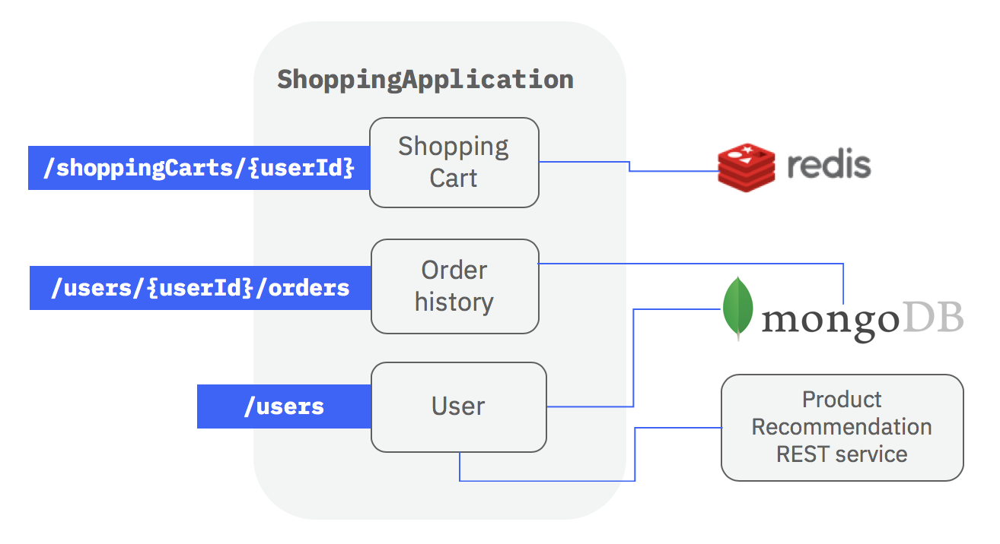
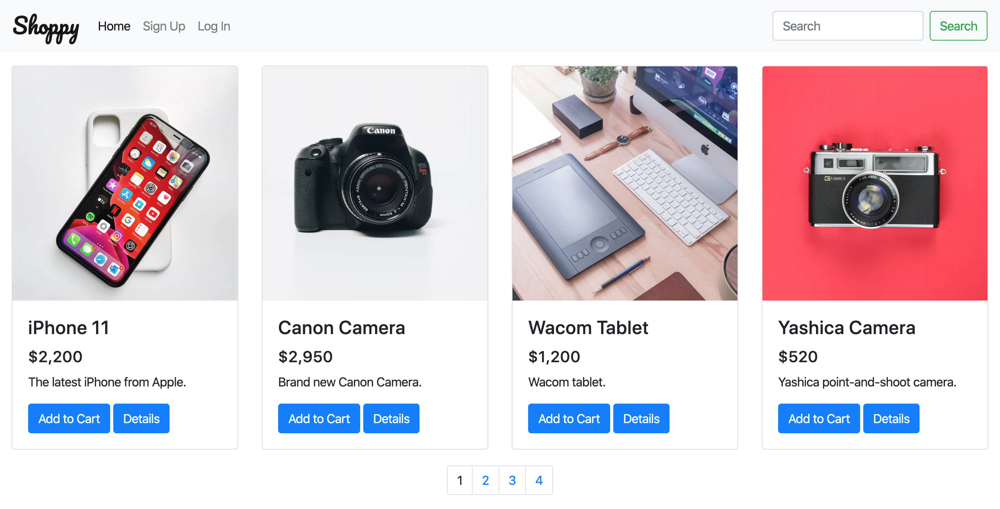

# @loopback/example-shopping

[](https://travis-ci.com/strongloop/loopback4-example-shopping)

This project aims to represent an online ecommerce platform APIs to validate /
test the LoopBack 4 framework readiness for GA. See
https://github.com/strongloop/loopback-next/issues/1476 for more information.



## Pre-requisites

Node.js >= 8.9.0 and running instances of a MongoDB and Redis server are
required for the app to start. The Redis server is used for the shopping cart,
while MongoDB is used for the rest of the models in the app.

Docker is required for running tests, make sure it is running if you want to run
the tests.

In case you have Docker installed on your system and don't want to manually
install MongoDB and Redis, you can run `npm run docker:start` to download their
images and start the servers.

## Installation

Do the following to clone and start the project.

```
git clone https://github.com/strongloop/loopback4-example-shopping.git
cd loopback4-example-shopping
npm i
npm start
```

## Usage

The main app will be running at http://localhost:3000. The shopping website
(Shoppy) is at http://localhost:3000/shoppy.html, and the API Explorer at
http://localhost:3000/explorer/.



You will also see `Recommendation server is running at http://localhost:3001.`,
it is the server to which the `services/recommender.service` service will
connect to get the recommendations for a user.

The app will be pre-populated with some products and users when it starts; and
all existing products, users, shopping cart and orders will be deleted too. If
you don't want to reset the database, set `databaseSeeding` to `false` in the
application configuration object.

## Models

This app has the following models:

1. `User` - representing the users of the system.
2. `UserCredentials` - representing sensitive credentials like a password.
3. `Product` - a model which is mapped to a remote service by
   `services/recommender.service`.
4. `ShoppingCartItem` - a model for representing purchases.
5. `ShoppingCart` - a model to represent a user's shopping cart, can contain
   many items (`items`) of the type `ShoppingCartItem`.
6. `Order` - a model to represent an order by user, can have many products
   (`products`) of the type `ShoppingCartItem`.

`ShoppingCart` and `Order` are marked as belonging to the `User` model by the
use of the `@belongsTo` model decorator. Correspondingly, the `User` model is
marked as having many `Order`s using the `@hasMany` model decorator. Although
possible, a `hasMany` relation for `User` to `ShoppingCart` has not be created
in this particular app to limit the scope of the example.

`User` is also marked as having one `UserCredentials` model using the `@hasOne`
decorator. The `belongsTo` relation for `UserCredentials` to `User` has not been
created to keep the scope smaller.

## Controllers

Controllers expose API endpoints for interacting with the models and more.

In this app, there are four controllers:

1. `ping` - a simple controller to checking the status of the app.
2. `user` - controller for creating user, fetching user info, updating user
   info, and logging in.
3. `shopping-cart` - controller for creating, updating, deleting shopping carts,
   and getting the details about a shopping cart.
4. `user-order` - controller for creating, updating, deleting orders, and
   getting the details about an order.

## Services

Services are modular components that can be plugged into a LoopBack application
in various locations to contribute additional capabilities and features to the
application.

This app has five services:

1. `services/recommender.service` - responsible for connecting to a "remote"
   server and getting recommendations for a user. The API endpoint at
   `GET /users​/{userId}​/recommend`, is made possible by this service.
2. `services/user-service` - responsible for verifying if user exists and the
   submitted password matches that of the existing user.
3. `services/hash.password.bcryptjs` - responsible for generating and comparing
   password hashes.
4. `services/validator` - responsible for validating email and password when a
   new user is created.
5. `services/jwt-service` - responsible for generating and verifying JSON Web
   Token.

## Authentication

_Note: This app contains a `login` endpoint for the purpose of spike and demo,
the authentication for the CRUD operations and navigational endpoints of model
User is still in progress._

### Login

The endpoint for logging in a user is a `POST` request to `/users/login`.

Once the credentials are extracted, the logging-in implementation at the
controller level is just a four step process. This level of simplicity is made
possible by the use of the `UserService` service provided by
`@loopback/authentication`.

1. `const user = await this.userService.verifyCredentials(credentials)` - verify
   the credentials.
2. `const userProfile = this.userService.convertToUserProfile(user)` - generate
   user profile object.
3. `const token = await this.jwtService.generateToken(userProfile)` - generate
   JWT based on the user profile object.
4. `return {token}` - send the JWT.

You can see the details in
[`packages/shopping/src/controllers/user.controller.ts`](https://github.com/strongloop/loopback4-example-shopping/blob/master/packages/shopping/src/controllers/user.controller.ts).

### Authorization

Endpoint authorization is done using
[@loopback/authorization](https://github.com/strongloop/loopback-next/tree/master/packages/authorization).
Use the `@authorize` decorator to protect access to controller methods.

All controller methods without the `@authorize` decorator will be accessible to
everyone. To restrict access, specify the roles in the `allowedRoles` property.
Here are two examples to illustrate the point.

Unprotected controller method (no `@authorize` decorator), everyone can access
it:

```ts
async find(
  @param.query.object('filter', getFilterSchemaFor(Product))
  filter?: Filter<Product>,
): Promise<Product[]> {
  ...
}
```

Unprotected controller method, only `admin` and `customer` can access it:

```ts
@authorize({
  allowedRoles: ['admin', 'customer'],
  voters: [basicAuthorization],
})
async set(
  @inject(SecurityBindings.USER)
  currentUserProfile: UserProfile,
  @param.path.string('userId') userId: string,
  @requestBody({description: 'update user'}) user: User,
): Promise<void> {
  ...
}
```

There are three roles in this app: `admin`, `support`, and `customer`. You can
go through the controller methods in
[user-controller.ts](/packages/shopping/src/controllers/user.controller.ts) and
[shopping-cart.controller.ts](/master/packages/shopping/src/controllers/shopping-cart.controller.ts)
to see which roles are given access to which methods.

The authorization implementation is done via voter functions. In this app, there
is just a single voter function - 'basicAuthorization'. It implements the
following rules:

1. No access if the user was created without a `roles` property.
2. No access if the user's role in not in the `allowedRoles` authorization
   metadata.
3. User can access only model's belonging to themselves.
4. `admin` and `support` roles bypass model ownership check.

For more details about authorization in LoopBack 4, refer to
https://loopback.io/doc/en/lb4/Loopback-component-authorization.html.

### Tutorial

There is a tutorial which shows how to apply the JWT strategy to secure your
endpoint with `@loopback/authentication@2.x`. You can check more details in
https://loopback.io/doc/en/lb4/Authentication-Tutorial.html

### Trying It Out

Please check the
[try it out](https://loopback.io/doc/en/lb4/Authentication-Tutorial.html#try-it-out)
section in the tutorial.

## Deploy to Cloud as Microservices

The example application can be packaged as multiple Docker containers and
deployed to a cloud environment as a Kubernetes cluster.

Please check out
[Deploy Shopping Application as Cloud-native Microservices](kubernetes/README.md).

## Contributing

This project uses [DCO](https://developercertificate.org/). Be sure to sign off
your commits using the `-s` flag or adding `Signed-off-By: Name<Email>` in the
commit message.

**Example**

```
git commit -s -m "feat: my commit message"
```

Other LoopBack 4 Guidelines apply. See the following resources to get you
started:

- [Contributing Guidelines](https://github.com/strongloop/loopback-next/blob/master/docs/CONTRIBUTING.md)
- [Developing LoopBack](./DEVELOPING.md)

## Team

See
[all contributors](https://github.com/strongloop/loopback4-example-shopping/graphs/contributors).

## License

[MIT](LICENSE)

[-@2x.png>)](http://loopback.io/)
