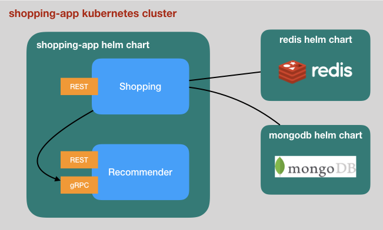

# Deploy the Shopping Application as Cloud-native Microservices using Kubernetes

The shopping example started as a monolithic application in early versions. It
has been refactored and improved over time to make the application modular. The
source code is now hosted as a [lerna](https://github.com/lerna/lerna) monorepo
with two packages:

- shopping (loopback4-example-shopping): an application developed with LoopBack
  4, including APIs and implementations for user, order, and shopping-cart
- recommender (loopback4-example-recommender): an Express application to mock up
  the product recommendation service

**NOTE**: From now on, we use `shopping` and `recommender` to refer to the two
microservices described above.

In addition, two resources are required for the application:

- A MongoDB database for users and orders
- A Redis registry for shopping cart items

There are a few approaches that we use to run or test the application:

1. Use `recommender` as a development dependency for `shopping` and invoke
   recommender service in the same process.
2. Use [concurrently](https://github.com/kimmobrunfeldt/concurrently) to start
   `recommender` and `shopping` as two local processes. The communication
   between `shopping` and `recommender` is over REST or gRPC.

Similarly, we install/start `mongodb` and `redis` in different ways:

1. Install `mongodb` and `redis` locally and start them as local processes
2. [Use `travis` services for `mongodb` and `redis` for the CI](https://github.com/strongloop/loopback4-example-shopping/blob/master/.travis.yml#L15-L17)
3. [Use `docker` to start `mongodb` and `redis` containers](https://github.com/strongloop/loopback4-example-shopping/blob/master/bin/start-dbs.sh)

You may start to wonder what's the best practice to deploy a composite
application, such as the shopping example that consists of multiple
microservices, to cloud environments. To answer those questions, we did some
experiments to bundle and deploy the shopping application as a Kubernetes
cluster. The introduction of Kubernetes-based solution removes deployment
inconsistencies and promotes cloud-native microservices.

# Kubernetes-based deployment

The shopping example application consists of multiple microservices that are
deployed as Docker containers managed by a Kubernetes cluster.

The `kubernetes` directory contains a helm chart and instructions for the
shopping application.



Some extra steps were taken to prepare for deployment to a Kubernetes cluster,
and to showcase gRPC communication between the microservices:

## Enable gRPC communication between shopping and recommender

REST APIs are used to connect `shopping` to `recommender`. To better facilitate
cloud-native deployment, we added the capability of using
`loopback-connector-grpc` to showcase [gRPC](https://grpc.io/), which is a
highly-efficient RPC protocol for communication between microservices.

By default, the shopping service calls recommender service using REST API. It
can be switched to gRPC by setting `RECOMMENDER_PROTOCOL` environment variable
to `grpc`. For example, to run tests with gRPC:

```sh
RECOMMENDER_PROTOCOL=grpc npm test
```

## Update datasources to pick up host/port configuration

The hosts for various datasources are set to `127.0.0.1` by default. It won't
work for a Kubernetes cluster where microservices are running on separate
hosts/ports. Such information is made available via DNS or environment
variables. See
https://kubernetes.io/docs/concepts/services-networking/connect-applications-service/#accessing-the-service
for more details.

To ensure datasources are configured correctly, we have to make some changes in
`datasources/*.datasource.ts` with similar code as follows:

```ts
if (process.env.KUBERNETES_SERVICE_HOST) {
  // The process is running inside a Kubernetes managed container
  // Configure the host/port for mongodb from environment variables
  config.host = process.env.SHOPPING_APP_MONGODB_SERVICE_HOST;
  config.port = +process.env.SHOPPING_APP_MONGODB_SERVICE_PORT!;
}
```

## Build docker images

We leverage a multi-stage build to create docker images for `shopping` and
`recommender` microservices.

- Stage 1: Build deployable packages using lerna

  - Dockerfile.monorepo

- Stage 2: Copy `shopping` and `recommender` packages into their own images
  - Dockerfile.shopping
  - Dockerfile.recommender

```sh
npm run docker:build
```

## Organize deployment as an Helm chart

Instead of deploying each of the docker images by hand, we use an
[`Helm`](https://helm.sh/) chart to describe the composition of the application
using Kubernetes artifacts. The chart is described in `kubernetes/shopping-app`.

As illustrated above, the chart includes two Kubernetes
[deployments](https://kubernetes.io/docs/concepts/workloads/controllers/deployment/)
and corresponding
[services](https://kubernetes.io/docs/concepts/services-networking/service/)
with Docker images built from the shopping application.

- shopping (exposing REST endpoints)
- recommender (exposing REST and gRPC endpoints)

The chart also depends on two other charts for the databases:

- [mongodb](https://github.com/helm/charts/tree/master/stable/mongodb)
- [redis](https://github.com/helm/charts/tree/master/stable/redis)

## Try it out

- [Run on your local machine with minikube](./docs/try-with-minikube.md)
- [Deploy to IBM cloud](./docs/deploy-to-ibmcloud.md)

## Future work

### Integrate with cloud-native observability

- Health
- Metrics
- Distributed tracing

### Integrate with service mesh

- [istio](https://istio.io/) integration
