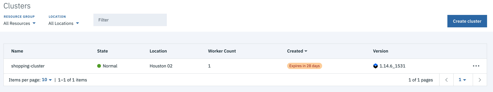
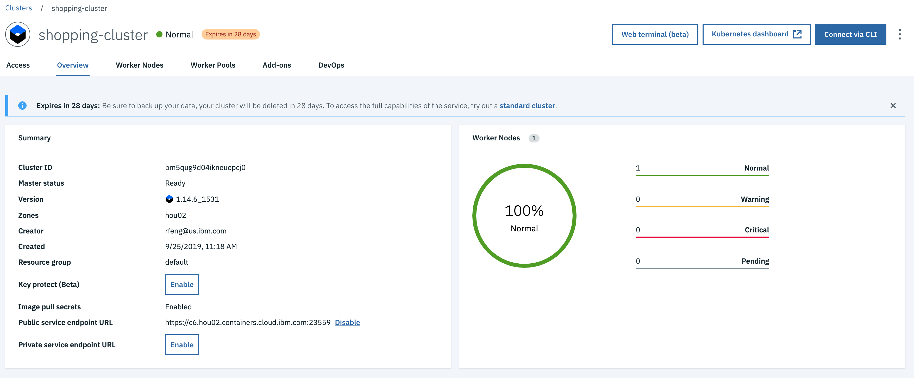
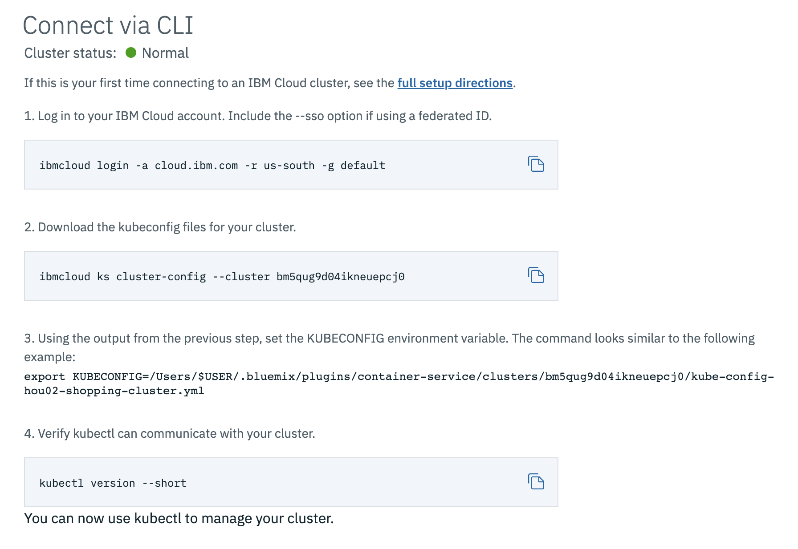
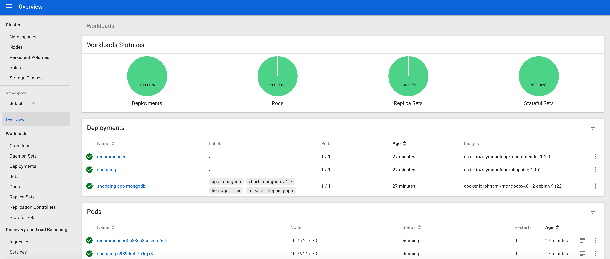

# Deploy to IBM Cloud

## Create a Kubernetes cluster

https://cloud.ibm.com/kubernetes/clusters



Click on `shopping-cluster` to view:



## Set up CLI for IBM Cloud

https://cloud.ibm.com/docs/containers?topic=containers-cs_cli_install

## Connect to IBM Cloud with CLI

If this is your first time connecting to an IBM Cloud cluster, see the
[full setup directions](https://cloud.ibm.com/docs/containers?topic=containers-cs_cli_install).



## Set up helm

https://cloud.ibm.com/docs/containers?topic=containers-helm

```sh
kubectl create serviceaccount tiller -n kube-system
kubectl create clusterrolebinding tiller --clusterrole=cluster-admin --serviceaccount=kube-system:tiller -n kube-system
kubectl get serviceaccount -n kube-system tiller
helm init --service-account tiller
```

## Set up IBM Cloud container registry

https://cloud.ibm.com/kubernetes/registry/main/start

## Upload images to IBM Cloud container registry

1. Login into IBM Cloud container registry

```sh
ibmcloud cr login
```

2. Use an existing namespace for the container registry or create a new one:

Please substitute `<your-namespace>` to container registry namespace you create
for IBM Cloud.

Existing namespaces can be listed:

```sh
ibmcloud cr namespaces
```

You can add a namespace as follows:

```sh
ibmcloud cr namespace-add <your-namespace>
```

3. Upload docker images

- Build docker images locally

```sh
npm run docker:build
```

- Tag and push images to IBM Cloud container registry

```sh
export CR_NAMESPACE=<your-namespace>
docker tag loopback4-example-shopping:1.0.0 us.icr.io/${CR_NAMESPACE}/loopback4-example-shopping:1.0.0
docker push us.icr.io/${CR_NAMESPACE}/loopback4-example-shopping:1.0.0

docker tag loopback4-example-recommender:1.0.0 us.icr.io/${CR_NAMESPACE}/loopback4-example-recommender:1.0.0
docker push us.icr.io/${CR_NAMESPACE}/loopback4-example-recommender:1.0.0
```

Please note that the fully qualified docker image name is in the form of
`<registry>/<namespace>/<repository>:<tag>`. For example,
`us.icr.io/raymondfeng/loopback4-example-shopping:1.0.0` represents the
following:

- registry - us.icr.io
- namespace - raymondfeng
- repository - loopback-example-shopping
- tag - 1.0.0

## Install the helm chart

1. Update `kubernetes/shopping-app/ibmcloud-values.yaml`:

```yaml
images:
  recommender: us.icr.io/<your-namespace>/loopback4-example-recommender:1.0.0
  shopping: us.icr.io/<your-namespace>/loopback4-example-shopping:1.0.0
```

2. Build the helm chart with dependencies

```sh
helm dependency build kubernetes/shopping-app
```

3. Install the helm chart to IBM Cloud

```sh
helm install --name shopping-app -f kubernetes/shopping-app/ibmcloud-values.yaml kubernetes/shopping-app/
```

If you have an existing release named as `shopping-app`, use the following
command to uninstall it:

```sh
helm del --purge shopping-app
```

## Open the kubernetes dashboard



## Access the home page for the shopping application

A few steps are involved to find the public URL of the application:

1.  Get the public IP of the k8s cluster

    ```sh
    ibmcloud ks worker ls shopping-cluster
    ```

    Sample output:

    ```
    ID                                                       Public IP       Private IP     Flavor   State    Status   Zone    Version
    kube-bm5qug9d04ikneuepcj0-shoppingclu-default-0000003e   173.193.79.83   10.76.217.70   free     normal   Ready    hou02   1.14.6_1533*
    ```

    In the example above, the public ip is `173.193.79.83`.

2.  Get the NodePort for `shopping` service

    ```sh
    kubectl describe services shopping
    ```

    Sample output:

    ```
    Name:                     shopping
    Namespace:                default
    Labels:                   service=shopping
    Annotations:              <none>
    Selector:                 service=shopping
    Type:                     NodePort
    IP:                       172.21.202.240
    Port:                     rest  3000/TCP
    TargetPort:               rest/TCP
    NodePort:                 rest  31094/TCP     <= Public Port is 31094
    Endpoints:                172.30.232.30:3000
    Session Affinity:         None
    External Traffic Policy:  Cluster
    Events:                   <none>
    ```

    In this example, the public port is `31094` as `NodePort: rest 31094/TCP`
    maps `31094` to `3000`.

3.  Open the home page

    ```
    http://<public-ip>:<public-port>
    ```

    In the example output, the public url is http://173.193.79.83:31094.
